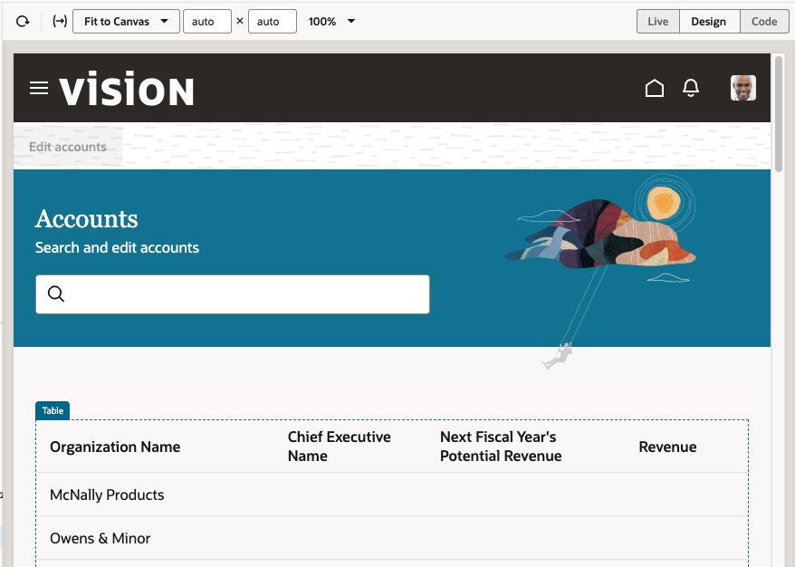
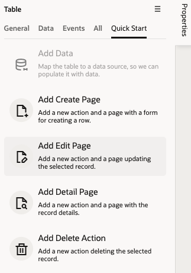
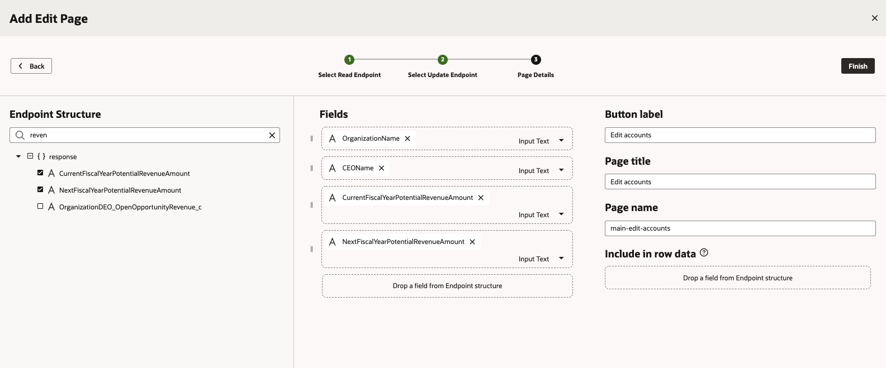
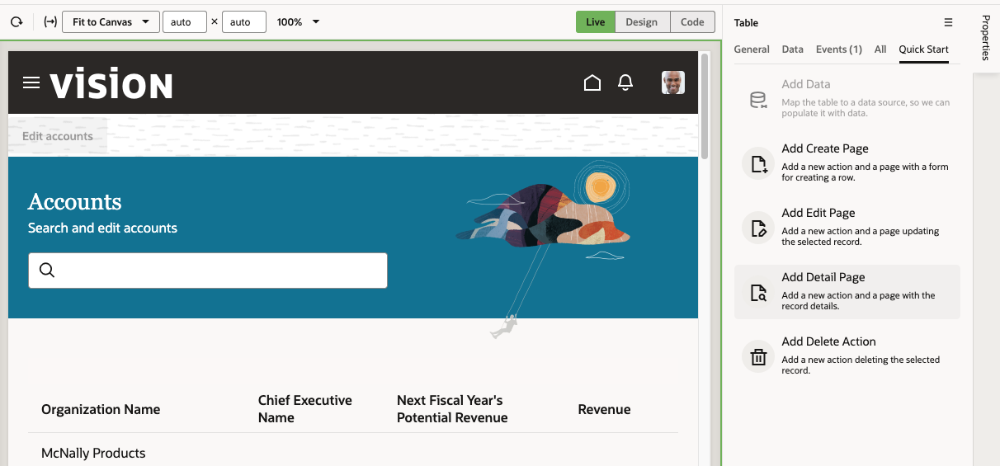

# Add Edit and Details Pages

## Introduction

In this lab we'll use Quick Starts to help us create additional pages for our app, so your users can manipulate the data coming from Oracle Fusion Cloud Apps.

Estimated Time: 10 minutes

### About VB Studio Quick Starts
VB Studio Quick Starts are guided dialogs that help you create user interfaces in a step-by-step fashion.  In this lab, we'll use Quick Starts to create pages that update, insert, delete, and view data.

### Objectives

In this lab, you will:
* Create an Edit page
* Create a Details page
* Preview your application

## Task 1: Create an Edit Page

When your account managers locate an account using our new page, it's quite possible that they may need to update the account data or insert new information as well. In this task we'll create pages to let them do that, using the default layouts that the Quick Starts provide. In the next lab, we'll tailor those layouts to provide additional functionality.

1. In Design view, select the table in either the Structure pane or on the canvas:

	

2. In the Properties pane, click the **Quick Start** tab:

  

	As you can see, there are different types of Quick Starts to help us create pages with different functions.  

3. Click **Add Edit Page**:
	  

	In the Add Edit Page dialog the **accounts** object is already selected, which is what we want.

4.  Click **Next**.

5. On this page we select the object that will be updated. **accounts** is already selected, so click **Next** here too:
	  

	This page lets us choose the specific fields we want to present on the Edit Page. We know there are four columns in our table, so let's use the filter field at the top to help us find those fields:
	  

6. Filter on **name**, then **revenue**, and select the following fields:
	* OrganizationName
	* CEOName
	* CurrentFiscalYearPotentialRevenueAmount
	* NextFiscalYearPotentialRevenueAmount

	  

7. Click **Finish** to complete the Quick Start and create the page.

	We're back on the Accounts search page in the Designer.  Notice that there's now an **Edit accounts** button at the top of the page:

	  

We'll come back to this later, but for now let's use another Quick Start to help us create a page that displays more details about each account.

## Task 2: Create a Detail Page

We'll use a similar process to create a page that displays more information on each account.

1. In Design view, select the table in either the Structure pane or on the canvas.

2. In the Properties pane, click the Quick Start tab:

  

3. This time pick **Add Detail Page**, which will create a page that lets users edit the details of a row selected from the table.

4. On this page, which identifies the object from which users will pick a specific record, the **accounts** object is already selected, so click **Next**:
  

5. On the Add Detail Page, use the filter field to search for and select these fields:

	* OrganizationName
	* CEOName
	* OwnerName
	* AddressLine1
	* AddressLine2
	* AddressLine3
	* AddressLine4
	* City
	* County
	* Country

  

	These are the fields that will provide more information about the selected record (that is, an individual account).

6. Click **Finish** to complete the Quick Start and create the page:
  

Now let's preview the updated app.

7. Click **Preview** in the header, then open the new browser tab:
  

8. When the page loads, experiment with searching for a specific record, selecting that record, then clicking the **Edit accounts** button.

9. Now try updating some fields, like the CEO Name and a Revenue field, then click **Save**.

	You'll see a pop-up confirming that this data has been submitted to Oracle Fusion Cloud Apps. It will be reflected in your table, too:

  

10. Click another record, then click the "account Details" button to find out the address of the account:

  

	 Use the browser's back button to return to the search page.

Our application is functioning well. In the next step we'll improve the usability, first by adding buttons to the table rows, and later by modifying the app's look and feel.

## Learn More

* [How Do Quick Starts Work?](https://docs.oracle.com/en/cloud/paas/visual-builder/visualbuilder-building-appui/work-pages-and-flows1.html#GUID-DD40C71D-A8AE-43E2-A2F4-798AF3D49983)

## Acknowledgements
* **Author** - Shay Shmeltzer, Oracle Cloud Development Tools, August 2022
* **Contributors** -  Marcie Caccamo, Blaine Carter, Oracle Cloud Development Tools
* **Last Updated By/Date** - Shay Shmeltzer, Oracle Cloud Development Tools, August 2022
