# Adding Buttons and Action Chains

## Introduction

This lab shows you how to work with components, events, and action chains to add functionality to your application.

Estimated Time: 10 minutes

### About Visual Builder
Visual Builder simplifies the way you handle user interface events enabling you to create business logic in a visual way with action chains.

### Objectives

In this lab, you will:
* Add user interfaces components to your page
* Define action chains that respond to UI events
* Work with variables

## Task 1: Add Empty Columns to the table

While the default UI that was created for us includes buttons at the top of the page - it would be nicer to have buttons at each row of the table that will allow us to choose a record and edit or show details. Let's see how we can modify the button and use icon based buttons for that.

1. Back in the Design view of the main-start page, select the table of accounts in either the structure pane or the visual editor.

	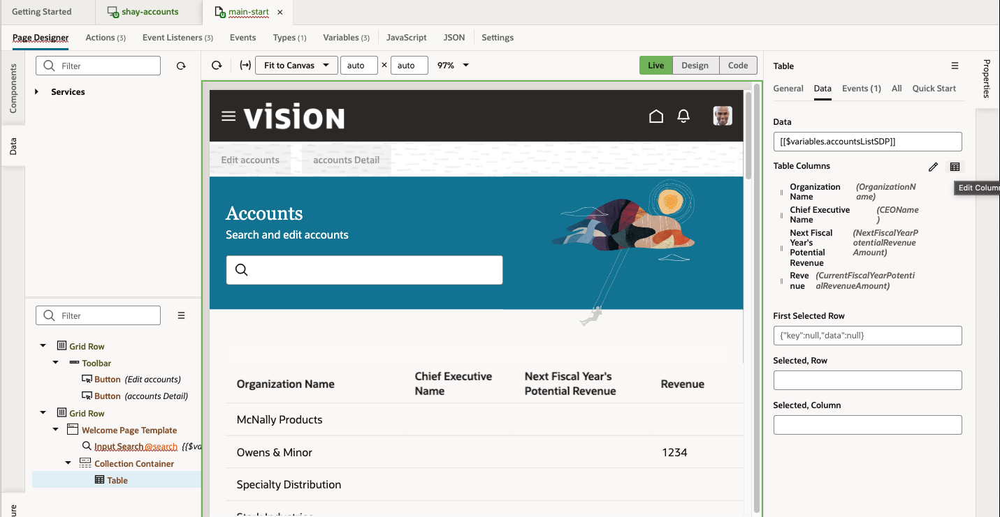

2. In the properties palette, select the data tab. Then click the little table icon at the top right of the list of columns.

  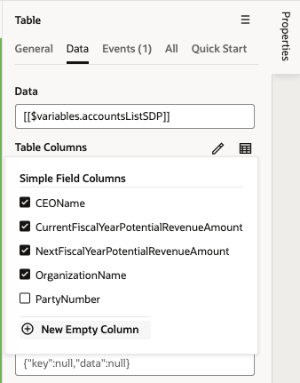
3. Click the **New Empty Column** twice to add two empty columns to your table.
	  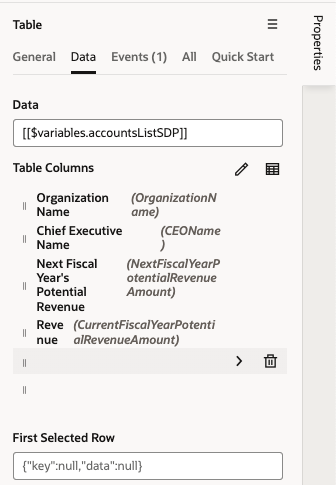

4. Click to select the first empty column and click the arrow on the right to go into this column's details.

5. Set the **Columns, Header Text** attribute to **Edit**. Then click the **Table Columns** back arrow at the top of the property palette to go back to the properties of the table.
	  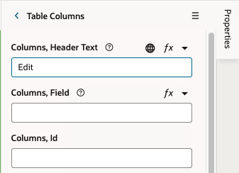
6. Go into the properties of the second empty column, and set the **Columns, Header Text** to **Info**.
	  
7. You'll see the new titles reflected in the visual editor too. Note that you can expand your visual editor area by collapsing the application navigator tab.

	  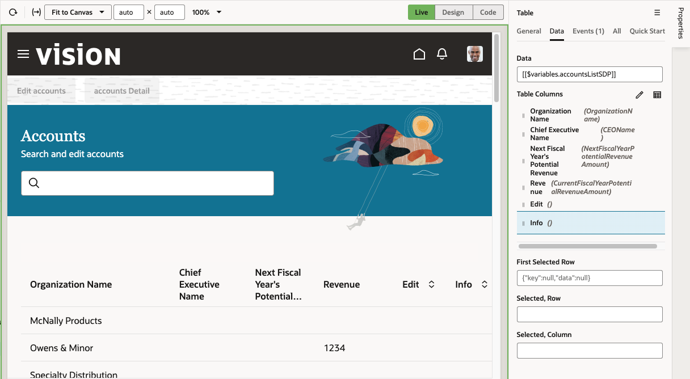

## Task 2: Adding Icon Buttons

Now let's add content to the empty columns we just created.

1. In the Design view of the application, make sure that the components palette is visible and use the search at the top to locate the button component.

	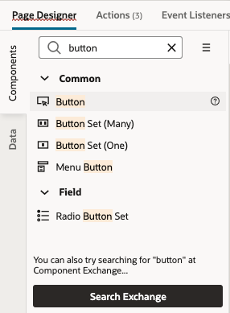

2. Drag and drop a button into the empty edit column of your table in the visual editor. Note that the editor highlights the location you can drop the button into. Make sure you drop it into the middle of the column.
	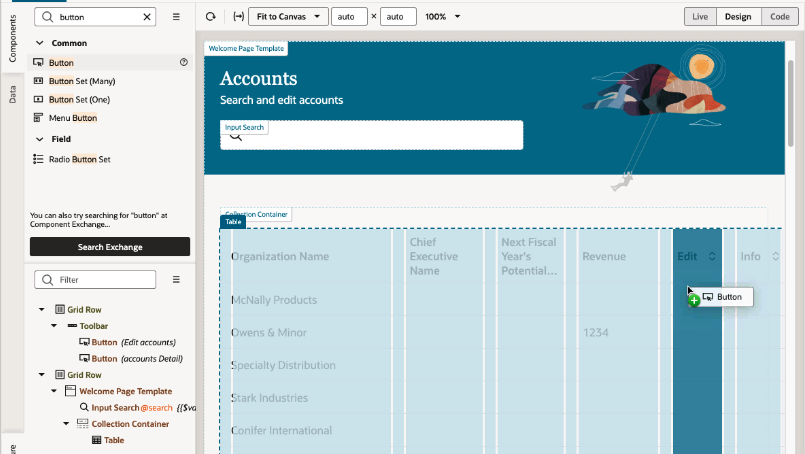
3. Repeat the process and drag another button into the info column.
	
4. Back in the components palette, use the filter to locate the icon component.
	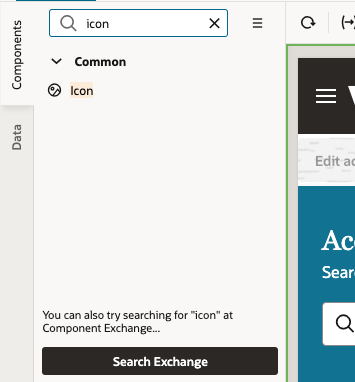
5. drag the icon into the structure pane and onto the first button (the one in the edit column). When prompted choose the **startIcon** as the slot for the icon.
	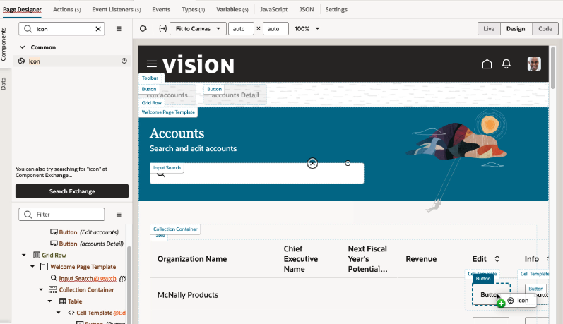
6. In the properties palette for the icon, click the icon to bring up the dialog for choosing a different icon image.
	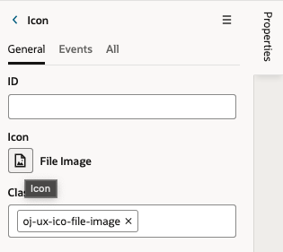
7. Search and locate an **Edit** icon and **Select** it from the list.
	
8. Drag another icon onto the second button, and then switch the icon for that button to be the **information** icon.
	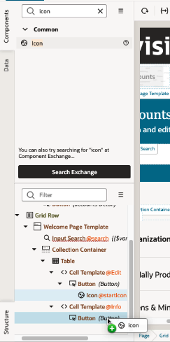

	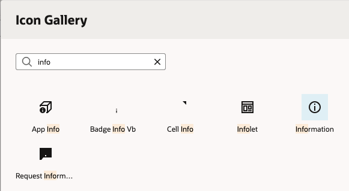
9. Pick each of the buttons in the visual editor, and then change the following properties:

| Property | Value |
| --- | --- |
| Display | icons |
| Chroming |Borderless |

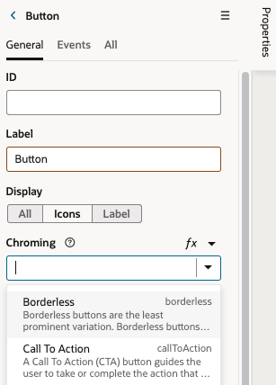

Your table now has action buttons that look good. The next step is to tell Visual Builder what these buttons should do when the user clicks on them.
	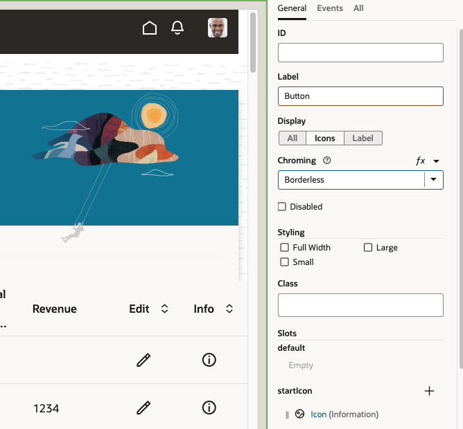
## Task 3: Define Action Chains

Visual Builder apps are event driven, when an end user performs an operation in the user interface it fires up an event. Developers create action chains to handle those events. An action chain defines a set of actions that will take place. Action chains are created visually in the action chain editor.

1. In the Design view of the application, select the Edit button, and in the properties palette switch to the **events** tab.

	

2. Click the **New Event** button and select the **On ojAction** option. This will take you into the action chain editor.
	
On the left side you see all the actions you can declaratively define including calling REST endpoints, invoking JavaScript function, and many more. The quick starts we used to create the edit and details page already created action chains that invoke the needed logic for us. All we need to do is call those existing action chains from the new action chain we are defining.

3. From the list of actions on the left select the **Call Action Chain** action and drag and drop it onto the + sign. (Alternatively you can click the + sign and choose general->call action chain).
	
4. In the property inspector, in the drop down list for the **Action Chain ID** select the **NavigateToEditAccountsChain**.
	
5. Note that this action expects a value for the input parameter **accountsid**. Click the **Not Mapped** text.
	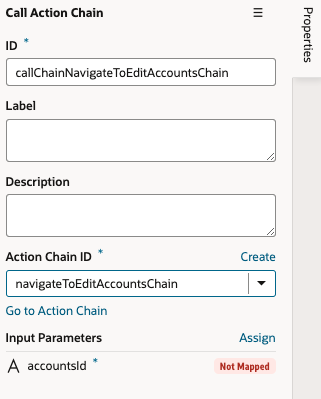
6. The dialog that shows up allows you to map values into variables in an easy drag and drop way.

7. From the left side select **Key** which is an Action Chain->Variable and drag it over to the right side's **accountsid** parameter.
	
8. Click the **Save** button to save your assignment.

9. Click the **Page Designer** tab to go back to the visual view of the main-start page.
	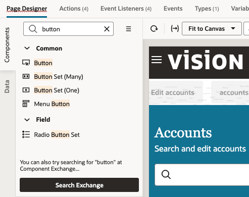
10. Repeat steps 1-9 this time for the **info** button. Create an **On ojAction** action chain, and in it add a **Call Action Chain** action. For the action you map this time choose the **NavigateToAccountsDetailChain** action and map the input parameter to the **Key** variable.
	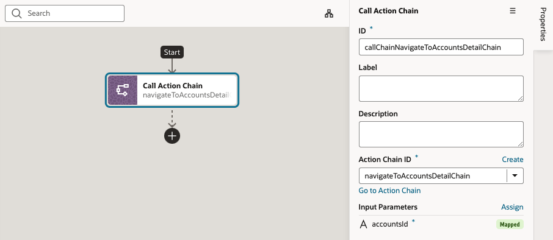
11. Click to **Preview** your updated page. See how you can now click the buttons in the lines to edit and get further information about each account.

12. If your buttons are working as expected, go back to the page editor and in the structure pane select the **Toolbar** component that contains the two buttons that were added by the quick starts. **Right Click** and  choose **delete** to remove them from your page.
	
	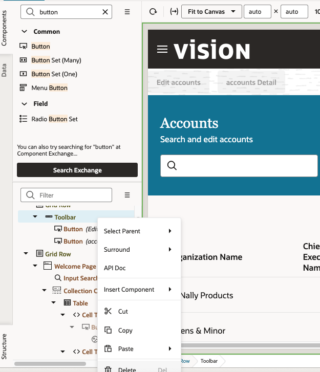

Your table now has action buttons that look good and work as expected. The next step is to fine tune the look and feel of the pages created by the quick starts and apply some Redwood templates to them.

## Learn More

* [Action Chains](https://docs.oracle.com/en/cloud/paas/visual-builder/visualbuilder-building-appui/work-action-chains.html)

## Acknowledgements
* **Author** - Shay Shmeltzer, Oracle Cloud Development Tools, August 2022
* **Contributors** -  Blaine Carter, Oracle Cloud Development Tools
* **Last Updated By/Date** - Shay Shmeltzer, Oracle Cloud Development Tools, August 2022
