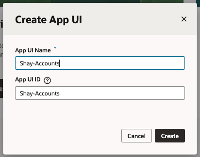
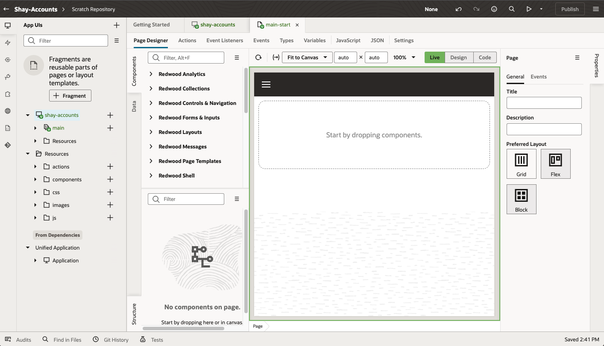
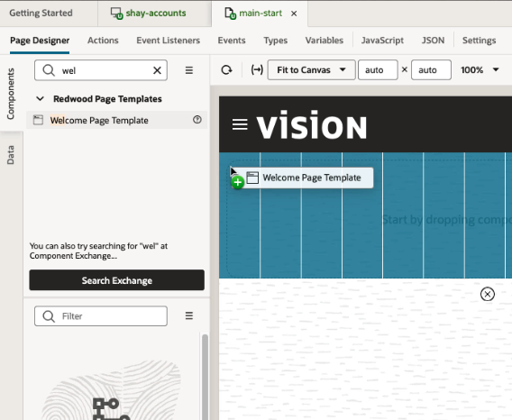

# Creating Your First Page

## Introduction

This lab walks you through creating a new App UI extension with a page. We then use a Redwood template to design the page's overall structure.

Estimated Time: 5 minutes

### About Oracle Visual Builder
In this lab we leverage the Redwood welcome page template along with Oracle JET UI components to create a page that connects to Oracle SaaS's object and show you a list of accounts and allows filtering the list.

### Objectives

In this lab, you will:
* Get familiar with the development environment
* Learn to create pages
* Leverage Redwood templates and components

## Task 1: Create an App UI application

You are now seeing the welcome page of the visual development area for Visual Builder applications. We'll now create a new application that could be deployed as an App UI extension to the Oracle SaaS instance. With App UIs you can create new interfaces that address specific business needs for your company.

1. On the left side of the application overview area click to create a new App UI

	

	> **Note:** Use this format for notes, hints, tips. Only use one "Note" at a time in a step.

2. In the dialog that pops up provide a name for your application **YourName-Accounts** and click Create

  

3. The application is created, and you are taken into the application overview tab where you can see your flows and pages. A flow is a part of your application that contains pages that relate to each other. An application can contain multiple flows, and a flow can contain many pages.

  

4. Double click the **main-start** page that was created in the main flow. This will open the page in the visual editor.

  

## Task 2: Designing your page

1. Let's explore the areas of the visual editor. Note that you can click on the various tabs to expand/collapse areas of your development environment.

  

  | #| Tab | Functionality |
  | --- | --- | --- |
  | 1 | Components | Contain UI components you can add to a page  |
  | 2 |Data | List data objects you can work with - based on connections you created to SaaS objects |
  | 3 | Structure | Hierarchical view of the structure of your page |
	  | 4 | Properties | A declarative way to define the properties of the selected component in your page |
	  | 5 | Visual Editor | Shows you a design/live and code view of your page content |
{: title="IDE areas"}

2. The components palette contains over a hundred UI components that you can drag and drop onto your pages to design your interfaces. We are going to leverage page templates designed by Oracle's Design team for the Redwood apps to accelerate our application development. The templates provide a responsive user experience and will adjust your application to the device accessing it.

3. Use the search box at the top of the components palette to search for **welcome** which will find the **welcome page template**. Drag the component from the component palette and drop it on the visual editor.  
  

4. Let's set some properties of the template. Click the **All** tab in the component palette and modify the following properties:

| # | Property | Value |
| --- | --- | --- |
| 1 | Background Color | Choose your preferred color  |
| 2 |Page Title | Accounts |
| 3 | Description Text| Search and edit accounts |
| 4 | Illustration Foreground | https://static.oracle.com/cdn/fnd/gallery/2107.1.0/images/illust-welcome-banner-fg-03.png |
{: title="Template Properties"}

  

## Task 3: Adding a search component and defining a variable

1. In the search box for the components palette type **search**. This will locate a component called **input search**.
2. Drag the input search and drop it on the page in the visual editor (or onto the structure pane on top of the welcome template). A popup will let you choose into which slot of the template to drop the component. Drop it into the **search slot**.
  

3. We need to keep track of the term the user is searching for. To do that we'll use a page variable.
While the input search is selected in the visual editor, click the **data** tab in the properties palette.

4. Click the little arrow at the top right of the value field to popup a list of variables.

5. Click the create **create variable** next to the page to create a page level variable. Note that we have multiple scopes for variables which makes it easy to share the values of these variables across pages and flow in the application when needed.
  

6. For the id of the variable type **searchString** and keep the type as String and click create. The value property now has a reference to the variable in it.
  

## Task 4: Adding a collection container and working with the structure pane

1. In the search box for the components palette type **collection**. This will locate a component called **collection container**.
2. Drag the collection container to the structure pane onto the Welcome Page template.
  
3. Select the **default** slot as the location for the collection container.
  
The layout of our first page is ready now, and the next step is to add some data to the page from Oracle Fusion Cloud Apps.
Note how so far all the design of the page was done with simple drag and drop functionality and setting properties. This visual development approach is key to the productivity offered by Visual Builder. Note however that there is a code button at the top right of the visual preview area. If you'll click on it you'll be able to see the actual HTML code used in your page. The code can be modified directly if needed, but for now we'll return to the design view by clicking the design button.
  

Now that our layout for the page is ready, it is time to get some data from Oracle SaaS into the page, which is what the next lab does.

## Learn More

* [Use the Page Designer](https://docs.oracle.com/en/cloud/paas/visual-builder/visualbuilder-building-appui/get-started1.html#GUID-CC2B203D-51D3-4408-8D0B-4E26C86BCBC0)
* [Oracle JET](http://oracle.com/jet)

## Acknowledgements
* **Author** - Shay Shmeltzer, Oracle Cloud Development Tools, August 2022
* **Contributors** -  Blaine Carter, Oracle Cloud Development Tools
* **Last Updated By/Date** - Shay Shmeltzer, Oracle Cloud Development Tools, August 2022
