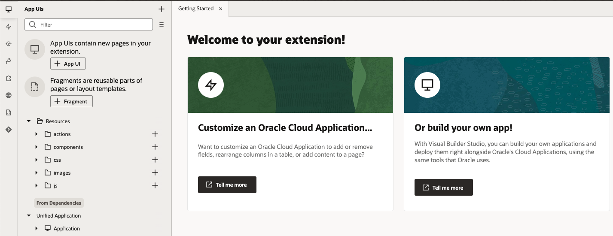
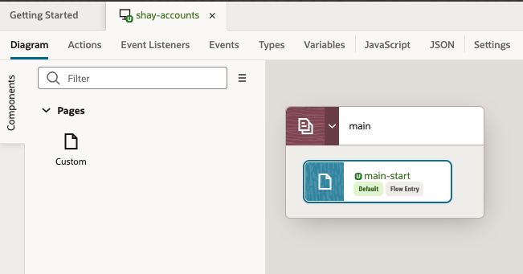
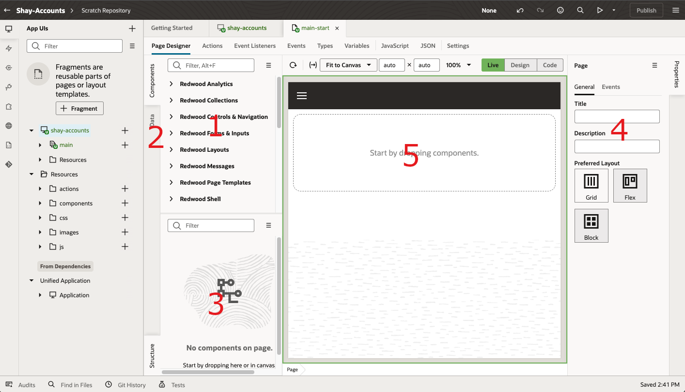
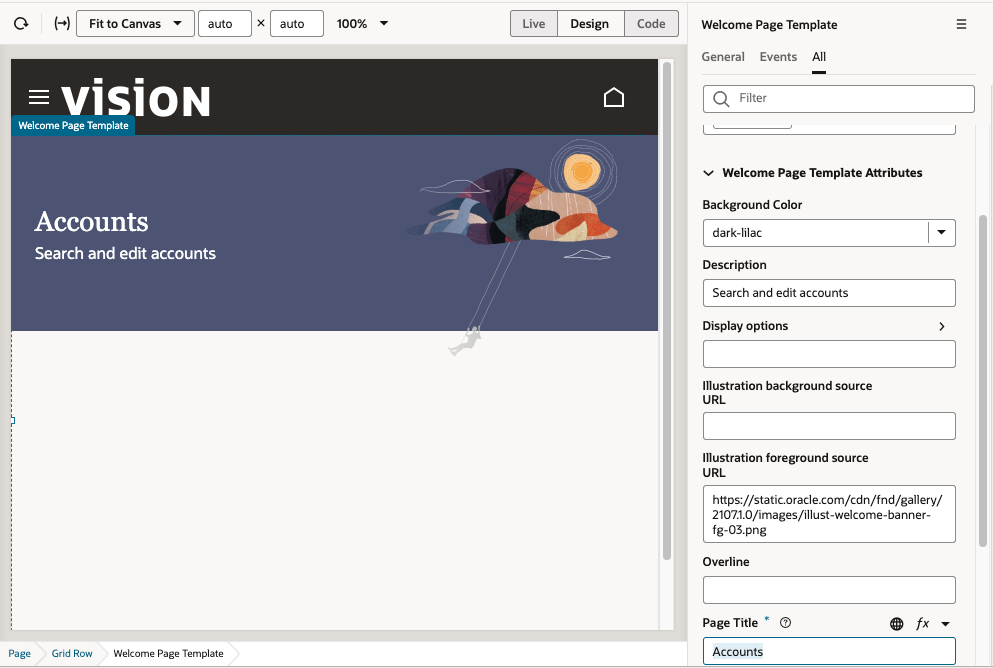
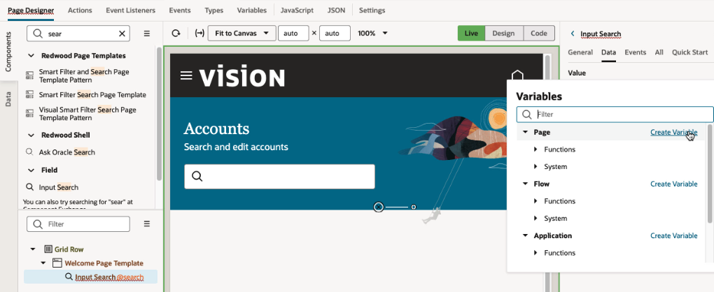
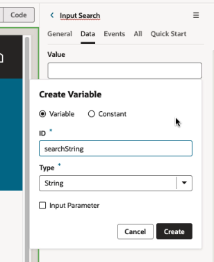
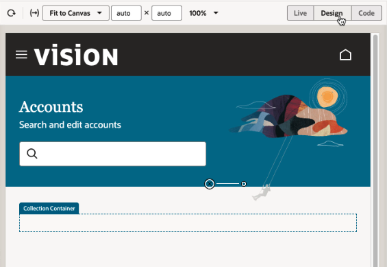

# Create Your First Page

## Introduction

In this lab we'll use the Redwood Welcome Page template, along with Oracle JET UI components, to create a page that connects to an Oracle SaaS object.  Our page will display a list of accounts, and allow the list to be filtered.

Estimated Time: 15 minutes

### Objectives

In this lab, you will:
* Get familiar with the development environment
* Learn to create pages
* Leverage Redwood templates and components

## Task 1: Create an App UI

You should now be in the Designer, VB Studio's visual editor. We'll start by creating an *App UI*, which is simply an application that includes a user interface component in the form of Visual Builder pages and flows. With App UIs, you can create new interfaces that address specific business needs for your company.

1. On the left side of the Designer, click **+ App UI**:  

	

2. In the Create App UI dialog, provide a name in the form **YourName-Accounts**, then click **Create**:

  

	In the Diagram view on the right, you can see the flows and pages for this App UI. A flow contains pages that relate to each other. An application can contain multiple flows, and a flow can contain many pages. In this case we have one flow, *main*, and one page, *main-start*:

  

3. Double-click  **main-start** to open the page in the Page Designer, one of the main visual editors in the Designer:

  

## Task 2: Add a Page Template

Before we get started, let's explore the Designer a bit.

**Tip:** There are lots of tabs you can click to expand/collapse different areas and give yourself more room to work.

  

Here are the key areas of the Designer you'll use throughout this workshop:

| # | Tab | Functionality |
| --- | --- | --- |
| 1 | Components | UI components you can add to a page, sorted into categories  |
| 2 | Data | Data objects you can work with, based on connections you create to SaaS objects |
| 3 | Structure | Hierarchical view of the page's structure  |
| 4 |Properties | Declarative area to define properties for the component selected in your page |
| 5 |Canvas | Displays a design/live view (or code view) of your page content |
{: title="Designer Regions"}

The Components palette contains over a hundred UI components that you can drag and drop onto your pages to design your interfaces. In this workshop, we're going to leverage some page templates designed by Oracle's Redwood Design team to accelerate our application development. These templates provide a responsive user experience, which means your app will adjust to the device accessing it.

1. Use the search box at the top of the Components palette to search for **welcome**, which will locate the **Welcome Page Template**. Drag the template from the Component palette and drop it on the canvas:
  

	Let's set some properties for the template to customize it a bit.

2. Click the **All** tab in the Properties pane and modify these properties:

| # | Property | Value |
| --- | --- | --- |
| 1 | Background Color | Choose your preferred color  |
| 2 | Description| **Search and edit accounts** |
| 3 | Illustration foreground | https://static.oracle.com/cdn/fnd/gallery/2107.1.0/images/illust-welcome-banner-fg-03.png |
| 4 |Page Title | **Accounts** |
{: title="Template Properties"}

Your screen should look like this:
  

In the next lab, we'll add some more useful components to the page.

## Task 3: Add a Search Component and Define a Variable

1. In the Components palette's search box, type **search**, which will locate a component called **Input Search**.
2. Drag this component and drop it on the page in the canvas. A pop-up will appear asking which slot you want to use; choose **Search slot**:
  

	This field is where users will enter a search term to locate an account. We need to keep track of these terms, so we'll use a page variable to do that.

3. While the input search is selected in the canvas, click the **Data** tab in the Properties pane.

4. Click the little arrow at the top right of the Value field to display a list of variables.

5. Next to the **Page** category, click **Create Variable** to create a page-level variable:

  

	Notice that there are multiple scopes for variables, which helps to share their values across pages and flows in the application.

6. In the Create Variable dialog's ID field, type **searchString**, leaving the Type as String. Click **Create**:

  

The Value field in the Properties pane now contains a reference to our new variable.

## Task 4: Add a Collection Container  

In this task we'll add a container to the page, which will later hold some data we'll get from Oracle Fusion Cloud Applications.

1. In the Components palette's search box type **collection**, which will locate a component called **Collection Container**.
2. Drag this component to the Structure pane and drop it on top of the Welcome Page template:
  
3. In the slots pop-up, select **Default**:
  
The layout of our first page is now ready.  Our next step is to add some data to the page from Oracle Fusion Cloud Apps.

Notice how all of our design tasks so far have been done with simple drag and drop functionality and setting properties. This visual development approach is key to the productivity that Visual Builder Studio provides. If you prefer to work in code, however, you can always do so by clicking the Code button right above where the page preview is displayed. Any modifications you make to your page's HTML code while in Code mode are automatically reflected in Design mode, should you choose to return to it.  

At this point your screen should look like this:
  

Let's move on to the next lab, where we'll learn how to get some data from Oracle SaaS onto the page.

## Learn More

* [Use the Page Designer](https://docs.oracle.com/en/cloud/paas/visual-builder/visualbuilder-building-appui/get-started1.html#GUID-CC2B203D-51D3-4408-8D0B-4E26C86BCBC0)
* [Oracle JET](http://oracle.com/jet)

## Acknowledgements
* **Author** - Shay Shmeltzer, Oracle Cloud Development Tools, August 2022
* **Contributors** -  Blaine Carter, Oracle Cloud Development Tools
* **Last Updated By/Date** - Shay Shmeltzer, Oracle Cloud Development Tools, August 2022
